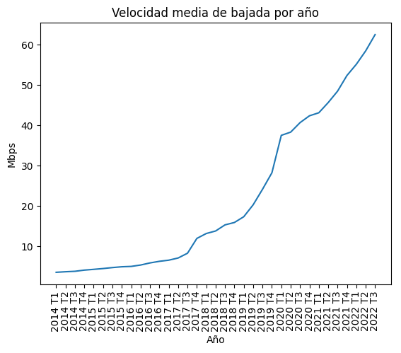
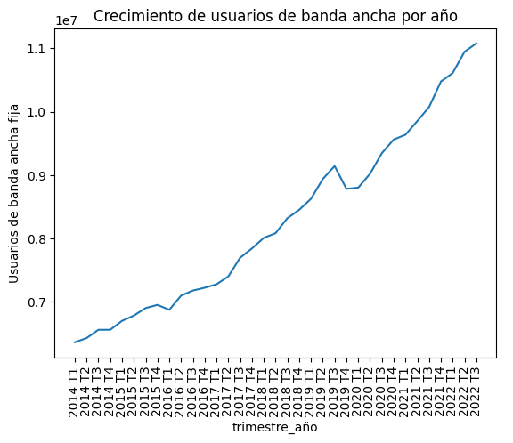
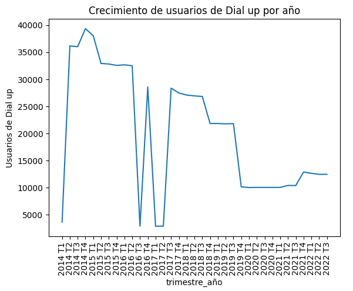
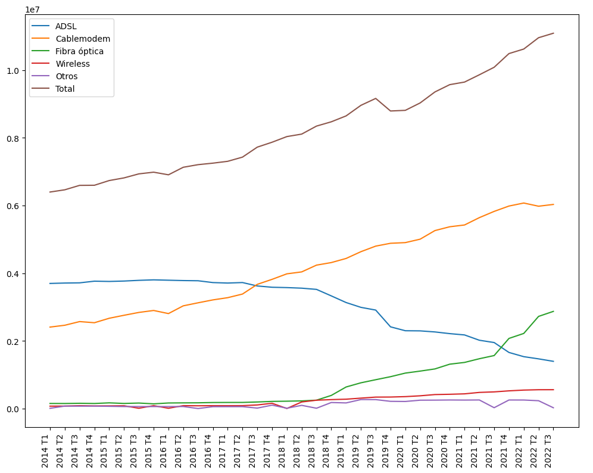

# ENACOM Analytics

Este proyecto pretende tomar los dataset de la pagina del ENACOM y hacer un analisis en profundidad de los datos sobre el acceso a internet en la Republica Argentina, con el fin de preoponer ciertos KPI's, entre las propuestas se encuentra aumentar el numero de hogares cada 100 con acceso a internet en un 2%. Para esto se tendran que seguir una serie de pasos, los cuales son ETL, para la limpieza de los datasets a utilizar y el EDA, en el cual se buscaran relaciones entre los datos, outliers y datos anormales

# ETL
A fin de trabajar con los datasets provistos por ENACOM es necesario hacer una limpieza y tranzformacion de los mismos, ya que en estos podemos encontrar algunos errores de formato.
En los errores de formatos de los datasets, hay que destacar dos de los mas frecuentes, todos los numeros superiores al millon, estan precentes como type objet, ya que estan precentados tal que por ejemplo

- Problemas con los datos numericos:
"1.000.000" no siendo un "int", a su vez, todo numero entre mil hasta un millon no incluido esta precentado en forma de flotante tal que por ejemplo docemil quinientos termina siendo doce punto cinco

- Datos erroneos:
En el dataset de Internet_penetracion podemos encontrar en "acceso cada 100 hogares" un error en los datos de capital federal, siendo que estos superan los 100 hogares cada 100 hogares, de este modo es que se recurrieron a fuentex externas para determinar que el acceso correcto es de 91 cada 100 hogares

# EDA
En el analisis exploratorio de datos podemos buscar patrones en los datos, correlaciones y tendencias.
- Por ejemplo, el siguiente grafico podemos ver el crecimiento de la velocidad media de bajada por trimestre:

- Aqui podemos ver como los usuarios de banda ancha aumentan rapidamente cada trimestres:

- En los usuarios de Dial up encontramos dos grandes valles en el grafico, que pueden deberse a errores en los datos, teniendo en cuenta que la cantidad de estos es marginal, no tendremos en cuenta estos datos:

- Con respecto a las tecnologias, podemos relacionar el crecimiento de cablemodem y fibra optica con el crecimiento de la velocidad media de bajada

# Analisis de los datos

El objetivo de este analisis es el de llevar a cabo un dashboard con los datasets presentados, con el objetivo de plantear un KPI que comprende un crecimiento del 2% en el acceso a internet y otros 3 KPI's claves relacionados al mismo, dichos KPI's deben de surgir de la necesidad de el primero y se deben evitar analisis innecesarios y/o redundantes. a su vez sera necesario hacer una precentacion coherence donde se explique como llevar ejecutar este objetivo valiendoce de las habilidades blandas para que el oyente pueda entender facilmente lo planteado.